<h1 align="center">Hi , I'm Dobromir Kirov (Bodrie)</h1>
<h3 align="center">A passionate software developer from Bulgaria</h3>

This page is auto generated by the repo itself

  

<a href="https://Bodrie.github.io/Bodrie/" target="_blank">
Check out the auto generated github pages as well
</a>

<h3 align="left">📬 Connect with Me:</h3>

  
  
  
  

<!-- STATS:START -->

  

  

  

<!-- STATS:END -->

<h3 align="left">🛠️ Languages and Tools:</h3>

<h4>💻 Programming Languages</h4>

  
  

<h4>⚛️ Frontend</h4>

  
  
  
  
  
  
  
  

<h4>🔧 Backend</h4>

  
  
  
  

<h4>🗄️ Databases</h4>

  
  
  
  

<h4>☁️ Cloud & DevOps</h4>

  
  
  
  

<h4>🧪 Testing</h4>

  
  

<h4>🛠️ Tools & Others</h4>

  
  
  
  
  
  
  

<h3 align="left">❗Disclaimer:</h3>
    

        This repository / template is provided by Petar Zarkov
    

    
